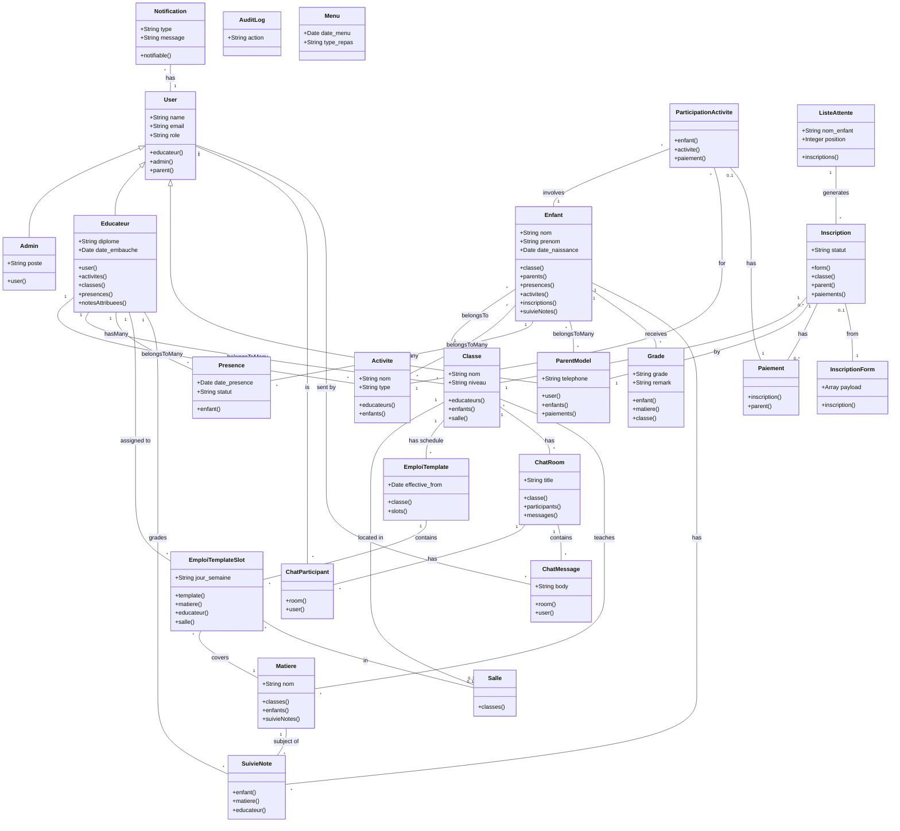

```mermaid
classDiagram
    %% Core Users
    class User {
        +String name
        +String email
        +String role
        +educateur()
        +admin()
        +parent()
    }
    class Admin {
        +String poste
        +user()
    }
    class Educateur {
        +String diplome
        +Date date_embauche
        +user()
        +activites()
        +classes()
        +presences()
        +notesAttribuees()
    }
    class ParentModel {
        +String telephone
        +user()
        +enfants()
        +paiements()
    }
    class Enfant {
        +String nom
        +String prenom
        +Date date_naissance
        +classe()
        +parents()
        +presences()
        +activites()
        +inscriptions()
        +suivieNotes()
    }

    %% Academic & Activities
    class Classe {
        +String nom
        +String niveau
        +educateurs()
        +enfants()
        +salle()
    }
    class Matiere {
        +String nom
        +classes()
        +enfants()
        +suivieNotes()
    }
    class Activite {
        +String nom
        +String type
        +educateurs()
        +enfants()
    }
    class ParticipationActivite {
        +enfant()
        +activite()
        +paiement()
    }
    class Salle {
        +classes()
    }
    class Grade {
        +String grade
        +String remark
        +enfant()
        +matiere()
        +classe()
    }
    class SuivieNote {
        +enfant()
        +matiere()
        +educateur()
    }
    class Presence {
        +Date date_presence
        +String statut
        +enfant()
    }

    %% Enrollment & Admin
    class Inscription {
        +String statut
        +form()
        +classe()
        +parent()
        +paiements()
    }
    class InscriptionForm {
        +Array payload
        +inscription()
    }
    class ListeAttente {
        +String nom_enfant
        +Integer position
        +inscriptions()
    }
    class Paiement {
        +inscription()
        +parent()
    }
    class Notification {
        +String type
        +String message
        +notifiable()
    }
    class AuditLog {
        +String action
    }
    class Menu {
        +Date date_menu
        +String type_repas
    }

    %% Scheduling
    class EmploiTemplate {
        +Date effective_from
        +classe()
        +slots()
    }
    class EmploiTemplateSlot {
        +String jour_semaine
        +template()
        +matiere()
        +educateur()
        +salle()
    }

    %% Chat System
    class ChatRoom {
        +String title
        +classe()
        +participants()
        +messages()
    }
    class ChatParticipant {
        +room()
        +user()
    }
    class ChatMessage {
        +String body
        +room()
        +user()
    }

    %% Relationships
    User <|-- Admin
    User <|-- Educateur
    User <|-- ParentModel
    Notification "*" -- "1" User : has
    
    Educateur "1" -- "*" Activite : belongsToMany
    Educateur "1" -- "*" Classe : belongsToMany
    Educateur "1" -- "*" Presence : hasMany
    Educateur "1" -- "*" EmploiTemplateSlot : assigned to

    Enfant "*" -- "1" Classe : belongsTo
    Enfant "*" -- "*" Activite : belongsToMany
    Enfant "1" -- "*" Presence : hasMany
    Enfant "*" -- "*" ParentModel : belongsToMany
    Enfant "1" -- "*" Grade : receives
    Enfant "1" -- "*" SuivieNote : has
    
    Matiere "1" -- "*" SuivieNote : subject of
    
    Educateur "1" -- "*" SuivieNote : grades

    Classe "1" -- "0..1" Salle : located in
    Classe "1" -- "*" EmploiTemplate : has schedule
    Classe "1" -- "*" ChatRoom : has
    Classe "*" -- "*" Matiere : teaches

    Inscription "1" -- "1" Classe : for
    Inscription "0..*" -- "1" ParentModel : by
    Inscription "1" -- "0..*" Paiement : has
    Inscription "0..1" -- "1" InscriptionForm : from
    ListeAttente "1" -- "*" Inscription : generates

    ChatRoom "1" -- "*" ChatParticipant : has
    ChatRoom "1" -- "*" ChatMessage : contains
    ChatParticipant "*" -- "1" User : is
    ChatMessage "*" -- "1" User : sent by

    EmploiTemplate "1" -- "*" EmploiTemplateSlot : contains
    EmploiTemplateSlot "*" -- "1" Matiere : covers
    EmploiTemplateSlot "*" -- "0..1" Salle : in

    ParticipationActivite "*" -- "1" Enfant : involves
    ParticipationActivite "*" -- "1" Activite : for
    ParticipationActivite "0..1" -- "1" Paiement : has
```
